# QSTicketEpicModule
Qlik Sense Ticket API module for use with Epic Hyperspace implementations

To install the solution, navigate to here: [https://github.com/eapowertools/QSTicketEpicModule/releases/tag/RC1](https://github.com/eapowertools/QSTicketEpicModule/releases/tag/RC1)

##Requirements
- Qlik Sense Enterprise Server 2.2.4 and above
- Epic Hyperspace 2015 (version 8.2)

##Installation
1. Download the installer from here: [QSTicketEpicModule](https://github.com/eapowertools/QSTicketEpicModule/releases/tag/RC1).
2. Run the installer with administrator privileges.    
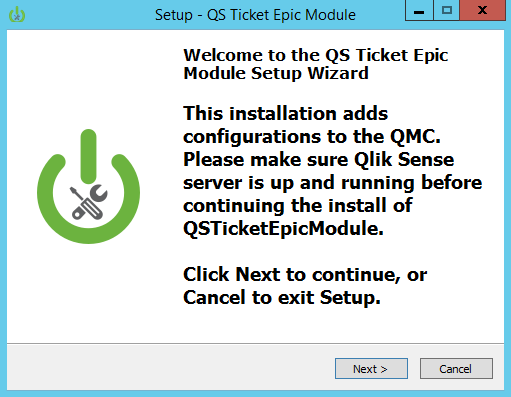
3. At the welcome screen click next.    
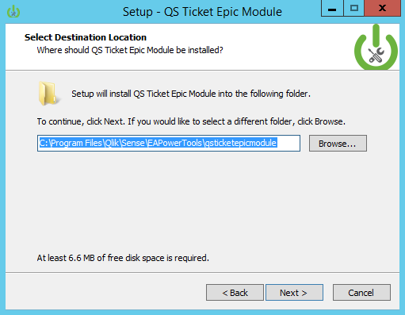
4. The default installation directory detects where Qlik Sense server is installed and adds an EAPowertools folder to that location.  Click Next to continue with the installation.
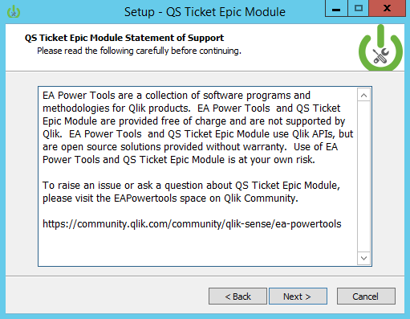
5. The Statement of Support communicates how to obtain support for the QSTicketEpicModule.   
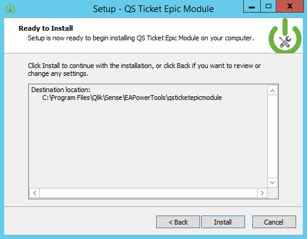

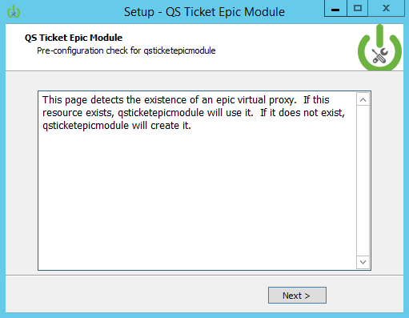
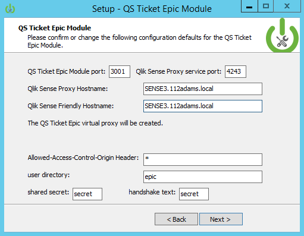
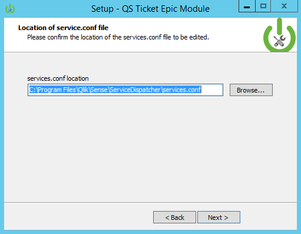
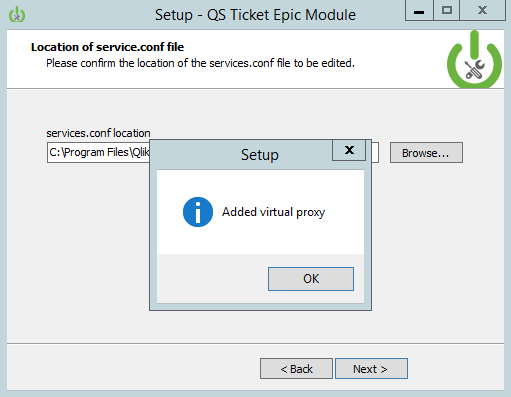

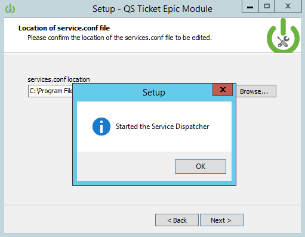
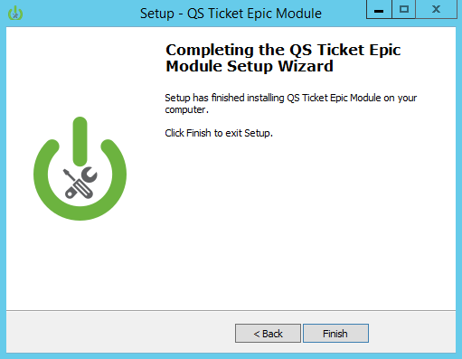
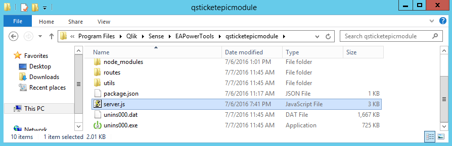
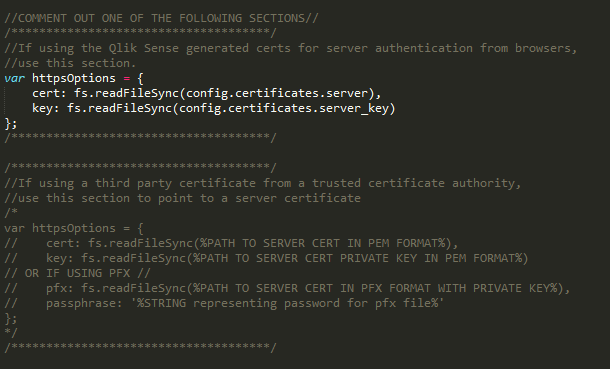
