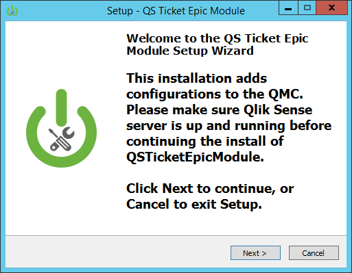
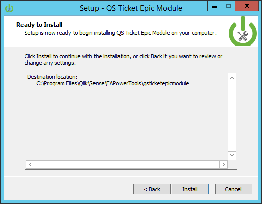

# QSTicketEpicModule
Qlik Sense Ticket API module for use with Epic Hyperspace implementations

To install the solution, navigate to here: [https://github.com/eapowertools/QSTicketEpicModule/releases/tag/RC1](https://github.com/eapowertools/QSTicketEpicModule/releases/tag/RC1)

##Requirements
- Qlik Sense Enterprise Server 2.2.4 and above
- Epic Hyperspace 2015 (version 8.2)

##Installation
1. Download the installer from here: [QSTicketEpicModule](https://github.com/eapowertools/QSTicketEpicModule/releases/tag/RC1).

2. Run the installer with administrator privileges.    

3. At the welcome screen click next.    

4. The default installation directory detects where Qlik Sense server is installed and adds an EAPowertools folder to that location.  Click Next to continue with the installation.    

5. The Statement of Support communicates how to obtain support for the QSTicketEpicModule.  Click Next.

6. The first configuration screen appears.  

	The QS Ticket Epic Module configuration screen appears.  By default, values are added for each configuration option.
  
  - __QS Ticket Epic Module Port:__ This is the port the authentication module will run on the server.
  - __Qlik Sense Node Hostname:__ The name of the Qlik Sense server as listed in the Node configuration of the QMC for the server the module is being installed on.  This is the name of the server provided during Qlik Sense server installation.
  - __Qlik Sense virtual proxy prefix:__ The endpoint for connecting to the Qlik Sense server through the Epic integration.  This value is set to "epic".
  - __Allowed-Access-Control-Origin Header:__ This value determines where requests for authentication may originate from.  By default, * means all sites.  For more information about this value, go **[here](https://developer.mozilla.org/en-US/docs/Web/HTTP/Access_control_CORS)**.
  - __user directory:__ The name of the user directory users who will be accessing Qlik Sense through this authentication module are members of.  This is equivalent to the domain name in an Active Directory, or the value set in a Qlik Sense UDC.
  - __shared secret:__ The shared secret is a value that corresponds with the key added to the configuration file of the **[QlikSenseEpic2015DLL](https://github.com/eapowertools/QlikSenseEpic2015DLL)**.  The shared secret must be 16 alpha-numeric characters in length in order to support integrations with Epic's HTML Web Component.
  - __handshake:__ The handshake is a value stored inside of Epic Hyperspace in the BI configuration.
   
	After confirming the configuration information, Click Next to continue the installation.

7. The second configuration screen handles the use of a common (friendly) hostname used to connect to Qlik Sense externally.

	If a different hostname (e.g. a hostname associated with a trusted certificate) is going to be used to connect to Qlik Sense through Epic, check the check box and enter the hostname that will be used in the text box.

	Click the Next button to provide references to the certificate to use this hostname.

8. If the check box on the previous screen is checked, a trusted certificate is necessary to make a secure connection to the integration with the common hostname entered.  This screen prompts for certificate file references.

	The certificate file location box accepts PEM or PFX file certificates.  When a PEM file is selected, a subsequent box will appear requiring a key file.

	  

	If a pfx file is selected, a passphrase is required to open the certificate file and read the private key.

	

	Click the Next button to continue the installation.

9. The Ready to Install screen appears to install the files for the ticketing module on the system.  Click the Install button to continue.  

10. Once the files are laid down on the system, the installer will perform a check to determine if the **epic** virtual proxy has been configured in the Qlik Sense QMC. If the virtual proxy does not exist, the install will create a virtual proxy called **epic** and confirm creation later in the installation process.  

  
11. On the config.js screen, the configuration supplied earlier in the installation will be added to the integration.  Click the Next button to continue.  

  
12. The service dispatcher screen explains how the integration will run.  It's important to note when Qlik Sense server is updated on the server the QS Ticket Epic Module is installed, the service that runs the integration is reset.  The note in this screen discusses where to find the configuration information for that service and input it.  Click Next to create the virtual proxy, and stop and start the Qlik Sense service dispatcher.  

  
13. After the virtual proxy is created and the service dispatcher is restarted, the installation is complete.Click Finish to exit the installer.  

